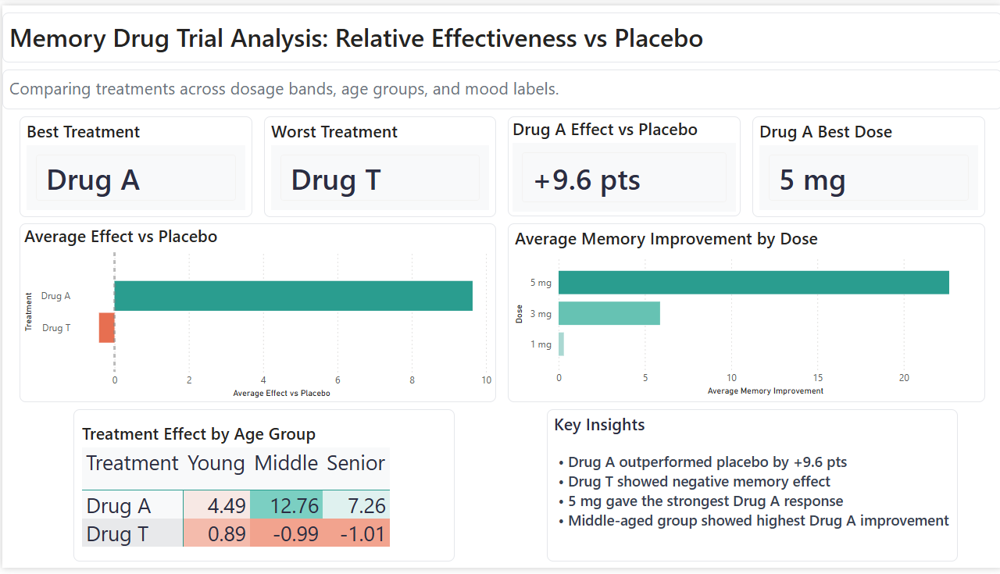

# Islander Memory Analysis  
### Statistical Evaluation of Drug Effects on Memory Using **R + Power BI**

## 📄 Full Analysis Notebook (with output)

Interactive HTML notebook available here:  
👉 https://curlykrissi.github.io/islander-memory-analysis/code/Islander_project.html

---

## Project Background

**Project inspired by ELIXIR Estonia – Statistics for Life Sciences in R Course**  

Original materials and dataset were provided under MIT license and can be found here:  
🔗 https://github.com/ELIXIREstonia/2025-04-24-R-visualisation

---

# Project Overview

This project analyzes the **Islander dataset** to investigate how different experimental drugs influence memory improvement.

The study evaluates whether treatment improves memory performance and explores how factors such as:

- Drug type  
- Dosage level  
- Age group  
- Emotional valence of memories  
- Family background  

may influence treatment response.

The project demonstrates a complete analytics workflow combining:

### Statistical Analysis in R
and

### Business Intelligence Dashboarding in Power BI

---

# Research Questions

The analysis addresses the following questions:

1. Do participants show overall memory improvement after treatment?  
2. Do different drugs produce different levels of improvement?  
3. Does dosage influence memory improvement?  
4. Does age affect treatment response?  
5. Does emotional valence influence recall?  
6. Do individuals from the same family respond similarly to treatment?  

---

# Dataset

The dataset contains measurements from participants who received one of three treatments:

- **Drug A**
- **Drug T**
- **Placebo**

> *(Original course dataset also included Drug S. Portfolio dashboard focuses on A, T, and Placebo for clearer business comparison.)*

---

## Key Variables

| Variable | Description |
|--------|-------------|
| Mem_Score_Before | Memory score before treatment |
| Mem_Score_After | Memory score after treatment |
| Diff | Change in memory score |
| Drug | Treatment type |
| Dosage | Administered dose level |
| Age_group | Participant age category |
| Happy_Sad_group | Emotional valence |
| Family | Family identifier |

---

# Methods

## Exploratory Data Analysis

- Summary statistics by treatment group  
- Distribution of memory improvement  
- Group comparisons across dosage and age  

---

## Statistical Testing

- **Paired t-test** → before vs after treatment  
- **ANOVA** → differences between drugs and age groups  
- **Tukey HSD** → pairwise post-hoc comparisons  

---

## Modeling

- Linear models to assess treatment and age effects  
- Predictor importance evaluation  

---

## Visualization in R

- Memory improvement by drug  
- Dose-response plots  
- Emotional valence comparisons  
- Heatmaps of family response patterns  

---

# Power BI Dashboard

To complement the statistical analysis, I designed an interactive **Power BI dashboard** summarizing treatment performance.

## Dashboard Highlights

- KPI cards showing:
  - Best treatment
  - Worst treatment
  - Best dosage
  - Effect vs placebo

- Treatment comparison charts  
- Dosage-response analysis  
- Age-group performance heatmap  
- Executive summary insights panel  

---

## Dashboard Preview



---

# Key Findings

## Drug A was the strongest treatment

Drug A significantly outperformed both Drug T and Placebo in memory improvement.

## Best Dosage: 5 mg

The strongest Drug A response was observed at the highest tested dosage.

## Middle-aged participants responded best

This age group showed the highest average improvement under Drug A.

## Drug T underperformed

Drug T showed neutral to negative memory effects in several subgroups.

## Family background had limited influence

No strong evidence that family grouping predicted treatment response.

---

# Business Value of This Project

This project demonstrates how raw experimental data can be transformed into stakeholder-ready insights through:

- Statistical testing  
- Data storytelling  
- Dashboard development  
- KPI reporting  
- Decision-support analytics  

---

# Technologies Used

## Data Analysis

- R  
- tidyverse  
- dplyr  
- ggplot2  
- reshape2  
- ggpubr  

## Business Intelligence

- Power BI  
- Power Query  
- Data Modeling  
- Interactive Dashboard Design  

## Version Control

- Git  
- GitHub  

---

# Repository Structure

```text
islander-memory-analysis/
├── code/
│   └── Islander_project.html
├── data/
├── graphs/
│   ├── Memory_improvement_treatment_Islander.png
│   └── R_visualizations.png
├── powerbi-dashboard/
│   └── Islander_Memory_Analysis.pbix
└── README.md
```text

# 🚀 Skills Demonstrated

- Data Cleaning
- Exploratory Data Analysis
- Hypothesis Testing
- ANOVA / Tukey HSD
- Data Visualization
- Dashboard Design
- Power BI Reporting
- Insight Communication

---

# 👩‍💻 Author

**Kristina Dmytruk**  
Data Analyst | Life Sciences Background | R • Python • SQL • Power BI

GitHub: https://github.com/CurlyKrissi
